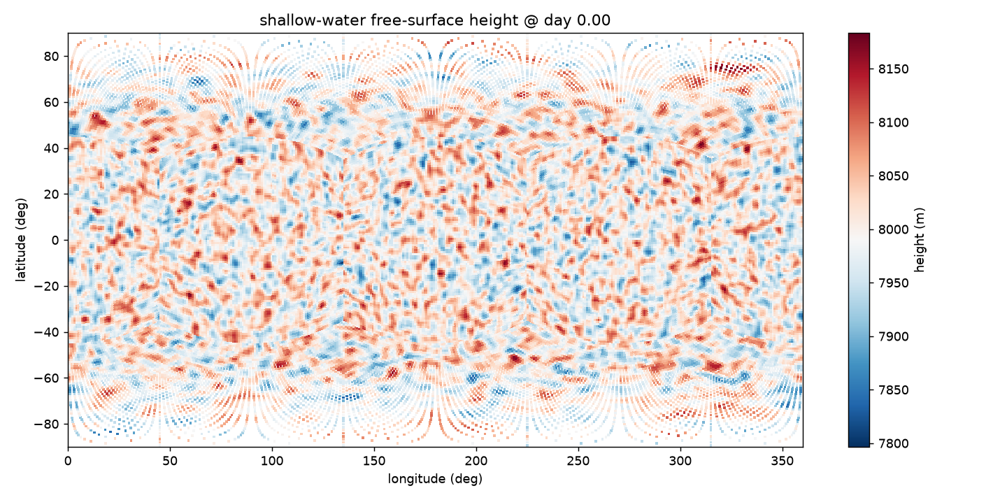
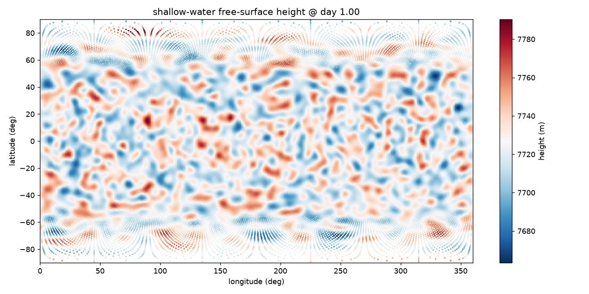

# moist-sw — global shallow water on the cubed sphere with random-noise initial conditions

A small, self-contained global **shallow-water model** built on
[**snapy**](https://github.com/chengcli/snapy), run on the gnomonic-equiangle
**cubed sphere** (all six faces). Instead of a balanced analytic initial state
like the bundled Williamson-1992 (**W92**) benchmarks, this case starts from a
**flat ocean at rest plus random noise of a configurable scale** injected into
the free-surface height. The Coriolis force then drives geostrophic adjustment,
radiating gravity waves and spinning up freely-evolving shallow-water
turbulence.

It reuses snapy's cubed-sphere shallow-water machinery — the `shallow-water`
equation of state, the `shallow-roe` Riemann solver, and the `coriolis`
forcing — the same components the W92 example uses, but with a trivially
specified (resting) background so **no `paddle` dependency is required**: it runs
on `snapy` alone.

This repo contains two models:

1. a **dry** global shallow-water model with random-noise initial conditions
   (`swe_noise.py`), described below;
2. a **moist** shallow-water model — a two-layer (weather + abyssal) system —
   following `main.tex`, see [Moist shallow water](#moist-shallow-water-two-layer-weather--abyssal).

| file | purpose |
|------|---------|
| `swe_noise.py`   | dry driver: builds the cubed-sphere mesh, injects the noisy IC, time-steps |
| `swe_noise.yaml` | dry configuration: geometry, cubed-sphere layout, solver, Coriolis, output |
| `moist_sw.py`    | moist driver: weather layer + abyssal reservoir, moisture as an operator-split source |
| `moist_sw.yaml`  | moist configuration (adds a vapour scalar `qv`) |
| `main.tex`       | derivation of the moist SW equations (the model `moist_sw.py` implements) |
| `plot_height.py` | plot the free-surface height from the NetCDF output (either model) |
| `requirements.txt` | Python dependencies (`snapy` + plotting) |



## Installation

Requires Python 3.9–3.13 on Linux (x86_64) or macOS (ARM64). Use a virtual
environment:

```bash
python3 -m venv .venv
source .venv/bin/activate
pip install -r requirements.txt        # installs snapy, matplotlib, netCDF4, ...
```

`pip install snapy` pulls in `torch`, `numpy`, `netCDF4`, and the rest of the
snapy stack automatically.

## Running

The driver is launched with `torchrun` (snapy's distributed entry point). A
single process holds all six cube faces (`blocks_per_process: 6`):

```bash
# CPU, one process, all six faces
torchrun --nproc_per_node=1 swe_noise.py --device cpu --output-dir out_noise
```

NetCDF files (`swe_noise.out0.*.nc`) are written to `--output-dir` every 6
simulated hours (see `outputs.dt` in the YAML), for `tlim` = 15 days.

A quick smoke test (a few cycles, finishes in seconds):

```bash
torchrun --nproc_per_node=1 swe_noise.py --device cpu --output-dir out_smoke --nlim 5
```

### Tuning the injected noise

Two CLI flags set "the scale" of the random perturbation added to the resting
height field (`H0 = 8000 m`):

| flag | meaning | default |
|------|---------|---------|
| `--noise-amp`    | standard deviation of the height perturbation, in **metres** (amplitude scale) | `50` |
| `--noise-smooth` | number of 3×3 smoothing passes; larger ⇒ longer correlation length / bigger eddies (length scale) | `2` |
| `--seed`         | base RNG seed; the run is fully reproducible for a fixed seed | `0` |

```bash
# larger-amplitude, larger-scale blobs, reproducible
torchrun --nproc_per_node=1 swe_noise.py --device cpu \
    --output-dir out_big --noise-amp 120 --noise-smooth 6 --seed 42
```

### Multi-GPU

Set the backend to `nccl` in `swe_noise.yaml` (`distribute.backend`) and launch
one rank per face:

```bash
CUDA_VISIBLE_DEVICES=0,1,2,3,4,5 \
torchrun --nproc_per_node=6 swe_noise.py --device cuda --output-dir out_noise
```

The driver only initializes a `torch.distributed` process group when
`WORLD_SIZE > 1`, so the single-process CPU command above needs no extra setup.

## Plotting

```bash
python plot_height.py out_noise/swe_noise.out0.00000.nc -o height.png
# -t <index> selects a time slice (default: last)
```

snapy unrolls the six faces into one array with 2D `lon`/`lat` coordinate
variables; the script scatters every cell at its (lon, lat) and colours it by
height `h = rho / g` (the shallow-water prognostic `rho` is the geopotential
`gh`).

## What to expect

At `t = 0` the height map is the injected noise (band-limited blobs around
8000 m, with the cubed-sphere panel structure faintly visible near the poles).
As the run proceeds, the unbalanced height field adjusts geostrophically:
gravity waves radiate, vortices form and merge, and the flow organizes into the
banded, eddy-rich structure characteristic of rotating shallow-water turbulence.

## Moist shallow water (two-layer: weather + abyssal)

`moist_sw.py` implements **"The one-layer model with moisture"** of `main.tex`
(eqs. 101–118): a single **weather layer** `(H, v, q)` coupled to an
infinitely-deep **abyssal** water reservoir `α₀` — the closed reduction of the
two-layer moist shallow-water system derived in that document.

It is built on the same snapy cubed-sphere shallow-water core as the dry case.
The dry dynamics (height `H`, momentum `Hv`, advection of the vapour mixing
ratio `q`) are integrated by snapy; the **moisture physics** are applied as an
operator-split source each step (the pattern the bundled HS94 / hot-Jupiter
benchmarks use):

```
precipitation     P₁ = max(H (q − qs)/τ₁, 0)        (relaxation)
top vertical vel.  W₁ = β₁ P₁                         (β₁ = L/(Cp Δθ))
abyssal feedback   W₀ = α₀ /(τ₂ q₀)
evaporation        E  = W₀ q₀

∂ₜH      = W₀ − W₁                                    (mass; momentum left to the dynamics)
∂ₜ(Hq)   = W₀ q₀ − P₁                                 (vapour)
∂ₜα₀     = ⟨P₁⟩ − α₀/τ₂                                (abyssal reservoir, area-mean)
```

A balanced steady state requires `β₁ = 1/q₀` (the document's `β₁ ≈ 1/q₁`); that
is the default.

### Running

```bash
# moist model, 10 simulated days, all six faces on one CPU process
torchrun --nproc_per_node=1 moist_sw.py --device cpu --output-dir out_moist

# quick smoke test
torchrun --nproc_per_node=1 moist_sw.py --device cpu --output-dir out_moist --nlim 20

# plot the weather-layer height (same script as the dry case)
python plot_height.py out_moist/moist_sw.out0.00004.nc -o moist_height.png
```

Multi-GPU is identical to the dry case (set `distribute.backend: nccl` and
`--nproc_per_node=6 --device cuda`).



### Moisture parameters

| flag | meaning | default |
|------|---------|---------|
| `--qs`     | saturation mixing ratio | `0.02` |
| `--q0`     | abyssal-layer mixing ratio | `0.05` |
| `--beta1`  | latent-heating factor `β₁ = L/(Cp Δθ)` | `1/q0` (balanced) |
| `--tau1`   | precipitation relaxation time (s) | `1e5` |
| `--tau2`   | abyssal evaporation/resupply time (s) | `5e4` |
| `--q-init` | initial weather-layer mixing ratio | `0.025` |
| `--gprime` | reduced gravity `g' = g·θ₁/θ₀` | `g` |
| `--noise-amp`, `--noise-smooth`, `--seed` | initial-height noise (as in the dry case) | `50`, `2`, `0` |

Modelling choices (where `main.tex` is loose): eq. 105's momentum RHS as written
omits the geopotential pressure-gradient term, so we keep snapy's standard
shallow-water pressure gradient with reduced gravity `g'`; `qs` is a constant
parameter rather than the full `q_s(P,T)`; `α₀`'s area integral uses an
equal-weight cell mean; and a positivity limiter (`--maxdrop`, `--hfloor`) caps
the per-step mass loss so a column that precipitates faster than it is
resupplied thins but never goes negative.

With the default balanced parameters the noisy weather layer geostrophically
adjusts into rotating mesoscale eddies (above) while `q` relaxes toward `qs` and
the abyssal reservoir `α₀` spins up to a quasi-equilibrium where `W₀ ≈ W₁`.

## Notes

- The noise is generated independently per face from `--seed` (seed + 1000·face)
  and smoothed within each face; cross-face continuity is handled by the
  solver's own panel exchange once the run starts, so small seams at panel
  edges in the very first snapshot are expected and quickly smooth out.
- Configuration knobs (resolution `nx2`/`nx3`, planet radius, rotation rate
  `omega1`, CFL, `tlim`, output cadence) live in `swe_noise.yaml`.
